# 《密室杀人事件》— 故事分支设计

> `/branches` 阶段输出 · 8 章 · 密室推理型交互式惊悚
> 参考：branch-architecture.md · choice-design.md · state-management.md
> 输入依赖：theme.md · trick-design.md · characters.md · structure.md · ch001.md · ch002.md

---

## 一、分支架构选择与论证

### 所选拓扑：瓶颈型 + 信任网络型 + 平行调查型（三重混合）

```
总体拓扑示意：

        ┌─ 观察路径 A ─┐
Ch1-2 ──┤              ├── ★ Jake 之死 ──┬── 调查链α ──┐
 瓶颈    └─ 观察路径 B ─┘   (固定事件)    ├── 调查链β ──┼── ★ 群体分裂
                                          └── 调查链γ ──┘   (固定事件)
                                                              │
        ┌── 信任 Sophie ──┐                                   │
Ch5-6 ──┤                  ├── ★ Dylan 洗清 ──── ★ Amber 之死
 瓶颈    └── 保持孤立 ────┘   (固定事件)        (固定事件)
                                                    │
        ┌── 合作推理（完整）──┐                     │
Ch7-8 ──┤                      ├──→ 结局分级（S/A/B/C）
 收束    └── 独立推理（碎片）──┘

★ = 固定瓶颈事件（不可跳过的核心剧情节拍）
```

### 为什么选择这个混合拓扑

| 拓扑成分 | 承担的功能 | 适配理由 |
|----------|-----------|---------|
| **瓶颈型** | 保证核心推理体验完整——Jake 之死、Amber 之死、Dylan 洗清、Ethan 揭示必须发生 | 密室推理的公平性契约要求所有线索呈现给读者；跳过任何核心事件会破坏推理链 |
| **信任网络型** | 驱动 Ch5-7 的核心选择——信任谁、怀疑谁决定信息获取和结局品质 | 与主题"恐惧→怀疑→毁灭 vs 信任→合作→真相"完美契合；信任选择 = 主题的活论证 |
| **平行调查型** | Ch3-4 和 Ch7 的线索收集——不同调查路径获得不同线索碎片 | 推理类型的天然形态；让玩家真正"参与"推理而非被动接受 |

### 分支系数与内容量估算

```
线性正文量：~31,000 字
分支系数：1.8（瓶颈型主导，调查段落贡献额外变体）
预估总内容量：~56,000 字（含所有分支变体文本）

决策点总数：16 个（Ch1×3 + Ch2×2 + Ch3×2 + Ch4×3 + Ch5×2 + Ch6×1 + Ch7×2 + Ch8×1）
决策类型分布：
  观察型（看什么）：     5 个（Ch1-2）
  调查型（查什么）：     4 个（Ch3-4, Ch7）
  反应/姿态型：         3 个（Ch2-3）
  信任/联盟型：         2 个（Ch5, Ch7）
  行动/对峙型：         2 个（Ch6, Ch8）
```

### 核心设计原则

```
1. 固定骨骼，变化肌肉
   骨骼：Jake 密室死亡 → 群体猜忌 → Amber 之死 → Dylan 洗清 → Ethan 揭示
   肌肉：线索密度、情感层次、角色弧光速度、推理完成度

2. 所有路径公平
   Knox 十诫要求所有线索在揭示前呈现给读者。
   因此核心线索（C01-C04）在固定文本中至少出现一次；
   分支只增加线索的"清晰度"和"情感回响"，不增减线索本身。

3. 选择塑造 Nora，不改写世界
   分支改变的是 Nora 的观察深度、信任选择、行动时机——
   改变的是"她如何体验这个故事"，而非"故事发生了什么"。
   这与 Nora 的角色弧光（旁观者→行动者）有机统一。

4. 二周目有新体验
   不同路径收集的线索类型不同（视觉/听觉/逻辑/情感），
   走不同路线会在 Ch7-8 获得不同的回忆闪回和推理角度。
```

---

## 二、状态变量系统

### 核心变量（影响结局）

| 变量名 | 类型 | 范围 | 初始值 | 设计角色 | 说明 |
|--------|------|------|--------|---------|------|
| `clue_depth` | 整数 | 0-15 | 0 | critical | 线索清晰度累积。每次非默认观察/调查 +1~2。决定推理展示的完整度 |
| `nora_agency` | 整数 | 0-100 | 10 | critical | Nora 的主动性指数。选择主动行动 +10~20，选择被动/沉默 -5~0。决定弧光转变的叙事节奏 |
| `trust_sophie` | 整数 | 0-100 | 30 | critical | 对 Sophie 的信任度。决定 Ch7 合作推理的深度，直接影响结局等级 |
| `suspect_ethan` | 整数 | 0-100 | 5 | critical | 对 Ethan 的怀疑度。内部追踪——Nora 的潜意识不安程度。影响 Ch7-8 对峙的叙事角度 |

### 线索追踪变量（集合型）

| 变量名 | 类型 | 说明 |
|--------|------|------|
| `found_clues` | 集合 | 已发现的核心线索 ID：{C01, C02, C03, C04, S01, S02, S03} |
| `clue_notes` | 集合 | 速写本中的标注 ID——选择特定路径后写入的"旁注" |

### 角色状态变量

| 变量名 | 类型 | 范围 | 初始值 | 说明 |
|--------|------|------|--------|------|
| `trust_dylan` | 整数 | 0-100 | 25 | 对 Dylan 的信任度——起始低，Ch6 可能跃升 |
| `amber_words` | 整数 | 0-2 | 0 | Amber 遗言获取程度：0=未听到，1=碎片（4B），2=完整（5B） |
| `know_mia` | 整数 | 0-3 | 0 | Mia 信息获取程度：0=不知道，1=知名字（5B），2=了解事件（6A），3=提前全貌（6A 条件） |
| `did_question_diary` | 布尔 | — | false | 是否在 Ch2 追问了日记来源（2B 选"追问"） |

### 体验追踪变量（非结局影响，用于闪回/变体文本）

| 变量名 | 类型 | 说明 |
|--------|------|------|
| `ch1_observed` | 枚举 | Ch1-1A 选择：jake / dylan / window |
| `ch1_arrival` | 枚举 | Ch1-1B 选择：explore_side / follow |
| `ch1_sketch` | 枚举 | Ch1-1C 选择：layout / window_lock / portraits |
| `ch2_blackout` | 枚举 | Ch2-2A 选择：open_door / stay_listen |
| `ch2_response` | 枚举 | Ch2-2B 选择：agree / question / silence |
| `ch3_investigation` | 枚举 | Ch3-3A 选择：window / floor / corridor |
| `ch3_accusation` | 枚举 | Ch3-3B 选择：defend / look_dylan / silence |
| `ch4_direction` | 枚举 | Ch4-4A 选择组合：room_ethan / room_observe / ethan_observe |
| `ch4_amber` | 枚举 | Ch4-4B 选择：listen / refuse |
| `ch4_notebook` | 枚举 | Ch4-4C 选择：timeline / path / skip |
| `ch5_plan` | 枚举 | Ch5-5A 选择：together / apart / explain |
| `ch6_response` | 枚举 | Ch6-6A 选择：ask / repeat / phone |
| `ch7_trust` | 枚举 | Ch7-7A 选择：cooperate / solo |
| `ch7_sketchbook` | 枚举 | Ch7-7B 选择：memory / logic / draw |
| `ch8_response` | 枚举 | Ch8-8A 选择：remember / reject / silence |

### 变量总数：25 个

```
决策变量 × 4 + 线索集合 × 2 + 角色状态 × 4 + 体验追踪 × 15 = 25

决策变量（影响结局）：clue_depth, nora_agency, trust_sophie, suspect_ethan
角色状态：trust_dylan, amber_words(整数枚举), know_mia(整数枚举), did_question_diary(布尔)
体验追踪：15 个轻量枚举——仅记录选择用于条件文本/闪回，不直接影响结局评分

机械相关变量 10 个（决策4 + 集合2 + 状态4），处于标准互动推荐范围内
```

---

## 三、选择点设计（Ch3-Ch8）

> Ch1-Ch2 的选择点设计已在各章正文末尾完成，此处不重复。
> 以下为 Ch3-Ch8 的新选择点。

---

### Ch3 · 密室（The Locked Room）

> 本章选择类型升级为 **调查型 + 反应型**。
> Jake 之死是第一个真正的冲击——Nora 的被动性格在这里第一次被考验。

#### 选择点 3A · 密室中的调查

- **触发位置**：发现 Jake 尸体后，群体在走廊等待。Nora 独自留在房间门口
- **触发方式**：其他人退到走廊。Ethan 在安慰 Amber。短暂的空隙
- **呈现形式**：视线聚焦（3 个可检查区域）

| 选项 | 内容概要 | 获取信息 | 变量影响 |
|------|---------|---------|---------|
| **检查窗户** | Nora 走到窗前，手指触碰插销。她注意到插销外侧有极细的划痕——金属对金属的摩擦痕。不是锈蚀，是有方向性的擦痕，像什么东西从外面滑过 | **C01 加强版**：划痕细节清晰植入。Nora 在速写本上画了插销特写并标注了划痕方向 | `clue_depth += 2`, `found_clues += C01_strong` |
| **检查地板** | Nora 低头看房间地板。窗户下方的木地板有一小块颜色比周围略深的区域——像是被水打湿后又风干了。形状不规则，但大致在窗户正下方 | **湿脚印遗留**：辅助线索，暗示有人从窗户方向带入了水。不够确凿，但在 Ch7 回溯时可串联 | `clue_depth += 1`, `clue_notes += wet_floor` |
| **退回走廊**（默认） | Nora 退后一步，关上门。她不想再看到 Jake 的脸。走廊里 Amber 的哭声在回荡。正文进入下一段 | **C01 基准版**：仅在正文中以"她模糊地注意到窗户似乎没什么异常"一笔带过 | `nora_agency -= 5` |

- **后续影响**：选"检查窗户"→ Ch7 推理窗锁机制时有完整的速写本记录可参照；选"检查地板"→ Ch7 串联"湿脚印+暴雨"时多一条证据线；选"退回走廊"→ Ch7 推理时信息较少但仍可达结论（正文兜底）

---

#### 选择点 3B · 面对群体的指控

- **触发位置**：大家在走廊中讨论 Dylan 的可疑之处。Ethan 说"每个人都需要说明昨晚在哪里"。Dylan 沉默
- **触发方式**：所有人看向 Dylan。压力可感知。短暂停顿
- **呈现形式**：文字选项（3 选 1）

| 选项 | 内容概要 | 获取信息 | 变量影响 |
|------|---------|---------|---------|
| **"先别急着下结论"** | Nora 开口了——声音小但清楚。所有人看向她。"我们还不知道发生了什么。门窗都锁着，如果是有人做的，怎么出去的？先搞清楚这个比怀疑任何人都重要。"Ethan 看了她一秒，然后点头："说得对。"他的认可让 Nora 松了口气——但也让她没注意到他语气中一闪而过的审视 | **Ethan 审视微反应**：Ethan 重新评估了 Nora。后续 Ch5 他会更注意控制 Nora 的信息获取。Ch7 回溯时此刻的"审视"变成一条线索 | `nora_agency += 15`, `suspect_ethan += 5`, `trust_sophie += 10`（Sophie 投来赞同的目光） |
| **看向 Dylan** | Nora 和所有人一样，目光转向 Dylan。她没有说话，但她的视线本身就是一种站队。Dylan 感受到了——他的肩膀微微缩了一下 | **群体动力观察**：Nora 作为旁观者看到了 Dylan 被注视时的反应——不是愤怒，是受伤。Ch6 Dylan 洗清时，这个记忆会产生愧疚回响 | `trust_dylan -= 10` |
| **低头不语**（默认） | Nora 低头看着地板。她有话想说，但没有说。走廊里的声音在她耳边像水一样流过 | **被动路径**：无额外信息。但 Nora 的沉默本身在后续产生重量——Ch5 Amber 被打断时，"又一次沉默"的模式被强化 | `nora_agency -= 5` |

- **后续影响**：选"别急着下结论"→ Sophie 对 Nora 的印象改善，Ch5 Nora 更容易获得 Sophie 的信任；选"看向 Dylan"→ Ch6 Dylan 洗清时增加一段 Nora 的内疚独白；选"低头不语"→ Ch5 被动性累积

---

### Ch4 · 猜忌（Suspicion）

> 本章是调查密度最高的一章。选择类型为 **平行调查型**——Nora 独自调查时的路线选择。
> 三个调查方向各自提供不同类型的线索碎片。

#### 选择点 4A · 独自调查的方向

- **触发位置**：群体争吵后分散。Nora 独自在 Lodge 中
- **触发方式**：自由行动的短暂窗口。画面显示三个方向的提示
- **呈现形式**：场景选择（3 选 2——可以调查两个地方，时间只够两处）

| 选项 | 内容概要 | 获取信息 | 变量影响 |
|------|---------|---------|---------|
| **重返密室（Jake 的房间）** | Nora 推开没上锁的房门（之前被撞开了）。她强迫自己不看床的方向。走到窗前——从窗户往外探身。石檐就在窗台下方。上面的灰尘有一条不自然的痕迹——像什么东西压过或擦过。雨水冲刷了大部分，但靠墙的一侧还残留着痕迹 | **C02 加强版**：石檐灰尘扰动。Nora 画进速写本并标注"被压过的痕迹" | `clue_depth += 2`, `found_clues += C02` |
| **检查 Ethan 的活动区域** | Nora 来到一楼杂物间（Ethan 说配电箱在这里）。配电箱门开着，她看到几个开关被动过的痕迹——灰尘被手指抹去了。旁边的工具架上少了一把一字螺丝刀。地上有泥脚印，尺码和 Ethan 的鞋吻合 | **S01 加强版**：Ethan 在杂物间的活动痕迹 + 失踪工具（一字螺丝刀 = 可能的撬锁工具）。还注意到 Ethan 手指上的细微擦伤（他递茶时看到的） | `clue_depth += 2`, `found_clues += S01`, `suspect_ethan += 10` |
| **观察群体（留在公共区域）** | Nora 没有离开大厅。她坐在角落画画——实际上在观察每个人。她注意到：Amber 和 Sophie 低声争论什么（Amber 的手在发抖）；Ethan 站在窗边，手机翻到一张照片——一个女孩的侧脸（Mia，但 Nora 不认识）；Dylan 缩在椅子上，速写本翻开着，画的不是风景——是一双手握在一起 | **角色洞察组**：Amber 的恐惧+秘密暗示、Ethan 手机上的 Mia 照片（Ch7 回溯时可串联）、Dylan 画的"牵手"（暗示恋爱关系，Ch6 洗清时呼应） | `clue_depth += 1`, `clue_notes += ethan_photo`, `clue_notes += dylan_hands` |

- **组合影响**（选 2）：
  - 密室+Ethan区域 → 物理线索最强路径。Ch7 推理时有完整的"石檐+工具+手伤"链条
  - 密室+观察群体 → 混合路径。物理线索+人物线索各半
  - Ethan区域+观察群体 → 人物线索最强路径。Ch7 推理偏向"为什么"而非"怎么做到的"
  - 跳过密室 → C02 仅以正文兜底呈现（Nora 在走廊窗户向外看时瞥见）
- **实现说明**：呈现为两步选择——第一步从三个地点中选择第一个调查方向，完成后从剩余两个中选第二个。不存在"都不选"的路径。UI 上已调查区域变灰不可再选

---

#### 选择点 4B · Amber 的试探

- **触发位置**：傍晚。厨房只有 Nora 和 Amber 两个人。Amber 在洗杯子，手在微微发抖
- **触发方式**：Amber 没有看 Nora，声音压得很低，像是在试探："There's something about Jake that nobody—"
- **呈现形式**：文字选项（2 选 1）
- **与 5B 的叙事区分**：4B 是私密空间里的试探性吐露，Amber 犹豫、声音小、被 Ethan 偶然出现打断。5B 是分散前走廊上的绝望尝试，Amber 更坚决、更急迫、被 Ethan 主动打断

| 选项 | 内容概要 | 获取信息 | 变量影响 |
|------|---------|---------|---------|
| **"你说，我听着"** | Nora 停下脚步，面对 Amber。Amber 咬了咬嘴唇——"Jake 不像你们以为的那样好。去年他做了很过分的事——对一个女生。我也有份。但——"这时走廊传来脚步声，Amber 立刻闭嘴。是 Ethan。"你们在聊什么？" Amber 摇头："没什么。" | **Amber 碎片**：Nora 获得了"Jake 对某个女生做过坏事+Amber 有参与"的模糊信息。虽然不完整，但 Ch6 发现手机短信时会与此串联——"Amber 说过的果然是真的" | `clue_depth += 2`, `amber_words = 1`, `nora_agency += 5` |
| **"现在不是说这个的时候"** | Nora 摇了摇头。不是不关心——是不敢。她怕知道太多反而更危险。Amber 张了张嘴，最后放开了她的袖子 | **错失信息**：Ch5 Amber 死后，Nora 会闪回这个瞬间——"她想告诉我什么？如果我听了……" 强烈的遗憾和愧疚 | `nora_agency -= 10` |

---

#### 选择点 4C · 速写本复查

- **触发位置**：临睡前，Nora 翻看速写本
- **触发方式**：速写本特写画面，标注已收集的信息
- **呈现形式**：互动式——玩家可以点击速写本上的不同标注进行"连线"

| 选项 | 内容概要 | 获取信息 | 变量影响 |
|------|---------|---------|---------|
| **连线"Ethan 的行踪"** | Nora 在速写本上标注了 Ch1-2-3 中 Ethan 每次不在场的时间点。画面呈现一个简易时间线：灯灭→Ethan 不在房间；脚步声→Ethan 去查配电箱；Jake 死亡→Ethan 第一个冲过去。三个点连在一起——模式若隐若现 | **C04 早期清晰化**：Nora 的速写本上多了一页"行踪时间线"。Ch7 与 Sophie 合作时直接使用这张图 | `clue_depth += 2`, `suspect_ethan += 15`, `found_clues += C04_early` |
| **连线"窗户与石檐"** | Nora 翻到 Ch1 画的窗锁特写和 Ch3/4 的窗户划痕标注。把窗锁机制和石檐位置画在同一页上。她用铅笔试着画了一条从一扇窗户沿石檐到另一扇窗户的路径——纯粹是因为空间关系的习惯 | **物理机制早期推演**：Nora 的速写本上有了"石檐路径图"。Ch7 推理时这张图是关键道具 | `clue_depth += 2`, `found_clues += path_sketch` |
| **不连线，合上速写本** | 太累了。信息太多太杂。Nora 合上速写本放在枕头旁边，闭上眼睛 | 无额外信息 | — |

---

### Ch5 · 分裂（The Split）

> 本章选择类型升级为 **信任/联盟型 + 行动型**。
> 这是 Nora 弧光转变的关键章节——从"看"到"做"。

#### 选择点 5A · Ethan 的方案

- **触发位置**：群体激烈争吵是否隔离 Dylan。Ethan 提出"大家分开锁好门"
- **触发方式**：Ethan 的提案说完后，短暂的沉默。所有人在消化
- **呈现形式**：文字选项（3 选 1），限时 8 秒（模拟群体压力下的决策窗口）

| 选项 | 内容概要 | 获取信息 | 变量影响 |
|------|---------|---------|---------|
| **"不，我们应该待在一起"** | Nora 说出了自己都意外的话。"分开更危险。如果凶手是我们中的一个人，分开就是给他机会。"Ethan 看着她，表情没变——但眉毛微微抬了一下。"那你建议怎么办？" Nora 没有后续方案。她只是直觉地反对。Sophie 开口了："她说得对。至少两两一组。" | **主题正面选择**：直接对抗反主题。Ethan 必须调整策略——他同意"两两一组"但操控了分组（让自己和 Amber 一组）。Amber 之死仍然发生，但 Nora 的愧疚更复杂："我提出了待在一起，但还是没能阻止" | `nora_agency += 20`, `trust_sophie += 15`, `suspect_ethan += 10`（他被质疑了） |
| **同意 Ethan 的方案** | Nora 点了点头。跟着多数人走——这是她一直以来的本能。各自回房，反锁门窗。走廊在身后变暗 | **反主题默认路径**：当前正文走向。Amber 之死是群体隔离的直接后果 | — |
| **"让 Dylan 解释清楚"** | Nora 看向 Dylan。"你昨晚到底去了哪里？如果你是清白的，说出来就好了。"Dylan 咬紧牙关。他的目光闪向 Sophie——只有一瞬间，但 Nora 捕捉到了 | **Dylan-Sophie 关系微暗示**：Nora 在 Ch5 就捕捉到了 Dylan 看向 Sophie 的眼神。Ch6 Sophie 站出来证明时，Nora 内心："原来如此——他当时看的就是她。" | `nora_agency += 10`, `trust_dylan += 10`, `clue_notes += dylan_glance_sophie` |

- **后续影响**：选"待在一起"→ Amber 之死的叙事方式改变（Ethan 在两人值班时趁 Amber 短暂独处下手），Nora 的愧疚层次更深但弧光更早松动；选"同意"→ 标准路径；选"让 Dylan 解释"→ Ch6 洗清时减少惊讶感，增加"我早有预感"的满足

---

#### 选择点 5B · Amber 最后的尝试

- **触发位置**：分散前的走廊。Amber 抓住 Nora 的手腕——比 4B 厨房时更用力、更急迫。"There's something you need to know—" Ethan 的声音从身后压过来
- **触发方式**：Ethan 主动打断（不是偶然出现）。选择窗口极短
- **呈现形式**：限时 3 秒（极短——模拟真实场景的瞬间决策）
- **与 4B 的叙事区分**：4B 是厨房里的犹豫试探，5B 是走廊上的绝望孤注——Amber 知道分散后可能再没机会了。{if amber_words == 1} Amber 的台词变为"我上次没说完——Jake 和我——"，接续 4B 的碎片

| 选项 | 内容概要 | 获取信息 | 变量影响 |
|------|---------|---------|---------|
| **抓住 Amber 的手，把她拉到一边** | Nora 做了一件她从来没做过的事——她主动行动了。"等一下，让她说完。"Ethan 停住了。Amber 看了看 Ethan，又看了看 Nora，最后小声说："Jake 和我去年……对一个叫 Mia 的女生做了很过分的事。我一直在害怕——是不是因为那件事……" Ethan 的表情在一瞬间变了。只有一瞬间。然后他恢复了平静："现在不是说这个的时候。先回房间。" | **Amber 完整陈述** + **Ethan 微表情**：Nora 获得了"Mia"这个名字和 Jake/Amber 的罪行概要。更重要的是，她看到了 Ethan 听到"Mia"时的反应。Ch7 回溯时这是最强证据之一 | `clue_depth += 3`, `amber_words = 2`, `nora_agency += 20`, `suspect_ethan += 20`, `know_mia = 1` |
| **（沉默/来不及反应）**（默认） | Ethan 的声音已经盖过了一切。Amber 松开了 Nora 的手腕。她们各自走向自己的房间。Amber 在走廊尽头回头看了 Nora 一眼——那个眼神后来被 Nora 记了很久 | **错失 + 遗憾**：标准路径。Ch6 Amber 死后，Nora 的遗憾成为弧光转变的催化剂："她想告诉我。而我什么都没做。" | `nora_agency -= 5` |

- **后续影响**：选"拉住 Amber"是全篇 `nora_agency` 最大的单次跃升。它让 Nora 的弧光在 Ch5 就开始实质转变（而非等到 Ch7）。同时提前获得"Mia"的名字，让 Ch6-7 的信息拼图更流畅。但这是一个极难选中的选项（3 秒限时 + 默认是沉默），有意制造"错过了才后悔"的体验——鼓励二周目。

---

### Ch6 · 二杀（Second Death）

> 本章选择收窄为 **1 个关键行动型选择**。
> 叙事节奏在此章加速——中点翻转、Dylan 洗清、Amber 死亡密集发生。
> 选择不宜过多，以免打断叙事冲击力。

#### 选择点 6A · 面对"Mia"的线索

- **触发位置**：发现 Jake 手机上与 Amber 的短信——"We handled the Mia thing"。四个人围在一起
- **触发方式**：手机屏幕的特写。所有人沉默
- **呈现形式**：文字选项（3 选 1）

| 选项 | 内容概要 | 获取信息 | 变量影响 |
|------|---------|---------|---------|
| **"Mia 是谁？有人知道吗？"** | Nora 直接发问。Dylan 摇头。Sophie 犹豫了——然后说："Mia Lawson。她……以前在我们学校。去年转走了——或者说消失了。我不太清楚发生了什么。" Sophie 的声音在说"不太清楚"的时候微微发颤。Ethan 一言不发 | **Mia 身份初步确认 + Sophie 的愧疚微暗示**：Nora 知道了 Mia 的全名，且注意到 Sophie "不太清楚"时的犹豫。Ethan 的沉默此刻看起来像震惊——但回看是克制 | `nora_agency += 10`, `know_mia = 2`, `trust_sophie += 5`, `suspect_ethan += 5` |
| **{if amber_words >= 1} "Amber 跟我说过——Jake 和她对 Mia 做过很过分的事"** | Nora 把 Amber 的话复述出来。{if amber_words == 2} 复述内容完整，包含 Mia 的名字和 Jake/Amber 的罪行。{if amber_words == 1} 复述为碎片——"Jake 对一个女生做过坏事"，没有 Mia 的名字，但与短信中的"Mia"串联。空气凝固了。Sophie 闭上眼睛——她知道。Dylan 看向 Sophie，握住了她的手。Ethan 站在窗边，背对所有人。"她说的是真的，"Sophie 的声音几乎听不见，"Jake 欺负了 Mia。Amber 散布了谣言。Mia……试过自杀。" | **信息跃迁**：Ch6 就获得了 Mia 事件的核心概况。Sophie 的坦白比标准路径提前一整章。Ethan 的沉默此刻更有重量——所有人都在反应，只有他没有 | `clue_depth += 3`, `know_mia = 3`, `trust_sophie += 20`, `suspect_ethan += 15` |
| **继续翻看手机** | Nora 没有开口。她继续翻看 Jake 的短信——更多的细节浮现。与 Amber 的对话记录里，他们讨论如何"处理"一个叫 Mia 的女生的投诉。语气轻蔑 | **文本证据**：比口头信息更确凿。Nora 截取了关键短信页面的照片（用自己手机拍的） | `clue_depth += 2`, `know_mia = 2`, `clue_notes += jake_texts` |

---

### Ch7 · 黑夜（Dark Night of the Soul）

> 本章是推理核心章。选择类型为 **合作推理型 + 信任/联盟型**。
> 这里的选择决定了 Ch8 揭示的完整度和情感深度。

#### 选择点 7A · 是否信任 Sophie

- **触发位置**：Sophie 找到 Nora，说她注意到了一些关于 Ethan 的事。她问 Nora 是否愿意一起调查
- **触发方式**：Sophie 和 Nora 单独在厨房。Sophie 的眼神认真而紧张
- **呈现形式**：文字选项（2 选 1），无限时（这是一个需要深思的决策）

| 选项 | 内容概要 | 获取信息 | 变量影响 |
|------|---------|---------|---------|
| **信任 Sophie，合作调查** | Nora 点了点头。这是她第一次主动选择信任一个人——不是因为对方可靠（她不确定），而是因为她不想再一个人面对了。两人坐下来，把各自注意到的东西摊开——Nora 的速写本 + Sophie 的观察。**合作推理段落激活** | **进入合作推理路线**——Ch7 后半部分是两人对照笔记、串联线索的完整推理过程。Sophie 提供 S02（鞋上灰尘）和她对 Mia 事件的知情（罪疚坦白）。推理链最完整 | `trust_sophie = 90`, `nora_agency += 20` |
| **独自调查，不完全信任** | "让我想想。"Nora 没有拒绝，但她需要先自己理清思路。她回到房间，翻开速写本。独自推理——速度更慢，线索串联有缺口，但也有一种孤独的专注力 | **独立推理路线**——Ch7 后半是 Nora 独自在速写本上推演。她能推出大部分结论，但缺少 Sophie 提供的 S02 和 Mia 信息中 Sophie 的视角。Ch8 对峙时底气略弱 | `trust_sophie += 10`, `nora_agency += 10` |

- **后续影响**：合作路线 → Ch8 对峙时 Sophie 站在 Nora 身边，推理展示更完整，Ethan 的反应也不同（面对两个人 vs 一个人）；独立路线 → Ch8 Nora 独自面对 Ethan，张力更高但更孤独，推理可能有缺口（取决于之前的 clue_depth）

---

#### 选择点 7B · 发现 Mia 的素描本后

- **触发位置**：Nora 在 Lodge 角落发现 Ethan 藏的 Mia 的素描本。最后一页写着"Mia Lawson"
- **触发方式**：素描本翻开的特写。Mia 的画风和 Nora 很像——安静的线条，观察者的视角
- **呈现形式**：内心独白选择（3 选 1）

| 选项 | 内容概要 | 情感效果 | 变量影响 |
|------|---------|---------|---------|
| **回忆图书馆里的 Mia** | Nora 的记忆闸门打开——图书馆靠窗的座位，一个安静的女孩，交换过的几句话和一个微笑。然后那个座位空了。"我看到了。我什么都没做。"灵魂黑夜完整激活 | **最强情感冲击**：Nora-Mia 镜像完整呈现。Nora 的愧疚成为她必须站出来的内在动力——不仅是为了保护活着的人，更是为了赎回当年的沉默 | `nora_agency += 15`, `clue_notes += mia_memory` |
| **专注于线索连接** | Nora 压下情绪，把素描本作为物证分析：Ethan 上次来 Lodge 时藏的→Mia 是 Ethan 在乎的人→Jake 和 Amber 伤害了 Mia→Ethan 的动机 | **逻辑优先**：推理链条清晰化。情感冲击延迟到 Ch8 Ethan 自白时才全面爆发 | `clue_depth += 2`, `suspect_ethan += 20` |
| **画 Mia** | Nora 翻开自己的速写本，对着 Mia 的自画像开始画她。线条与线条之间——两个安静的女孩，一个消失了，一个还在。这是 Nora 用自己的语言记住 Mia 的方式 | **角色弧光升华**：预示 Ch8 结尾意象（Nora 画 Mia 的肖像）。弧光的转变不只是"站出来"，更是"用画笔记住被遗忘的人" | `nora_agency += 10`, `clue_notes += drew_mia` |

---

### Ch8 · 揭示（Revelation）

> 本章选择收窄为 **1 个对峙型选择**。
> 推理展示和动机揭示是固定叙事——它们是全篇的 payoff，不宜分支化。
> 唯一的选择影响 Nora 面对真相后的态度，决定情感结局的色调。

#### 选择点 8A · 面对 Ethan 的自白

- **触发位置**：Ethan 讲完了 Mia 的故事。"Do you even remember her?" 大厅陷入沉默
- **触发方式**：长停顿。壁炉的火快要灭了。所有人都在消化
- **呈现形式**：文字选项（3 选 1），无限时（让玩家真正思考）

| 选项 | 内容概要 | 情感色调 | 与主题的关系 |
|------|---------|---------|------------|
| **"我记得她"** | Nora 的声音在颤抖。"图书馆靠窗第三个座位。她喜欢画树。有一次她借了我的 2B 铅笔没还。我记得她。"这是 Nora 对 Ethan 最终问题的直接回应——也是对自己沉默的赎罪 | **悲悯型结局**：不原谅 Ethan 的行为，但承认他的痛苦。Nora 和 Ethan 在这一刻有了交汇——两个因为沉默而痛苦的人，选择了不同的路 | 正主题完成："记住"是信任的极致形式——信任一个被遗忘的人值得被记住 |
| **"你做的事不会让她回来"** | Nora 看着 Ethan 的眼睛。她的声音平静了——不是冷漠，是经历了恐惧之后的某种透彻。"Jake 和 Amber 做了可怕的事。但你做的事也是。Mia 不会因为他们死了就好起来。" | **理性型结局**：直面道德灰色地带。不回避 Ethan 的痛苦，但也不美化复仇。Nora 在这里展现了她成长后的核心特质：看清一切，然后选择说出来 | 主题的完整辩证："怀疑毁灭"与"信任拯救"之外，还有"真相的重量" |
| **（无法开口）** | Nora 张了张嘴。什么都说不出来。太重了——Mia 的故事、Ethan 的悲痛、Jake 和 Amber 的罪、她自己的沉默。她低下头。眼泪滴在速写本的空白页上 | **沉默型结局**：Nora 没有完成"说出来"的弧光——但她的沉默在此刻不再是被动的。这是一种被真相压垮的、有重量的沉默。它不完美，但它真实 | 弧光的"不完美版本"：Nora 看到了一切，理解了一切，但无法承受将一切说出口的重量 |

---

## 四、结局分级系统

### 结局触发矩阵

```
结局等级由以下公式决定：

ending_score = clue_depth + (nora_agency / 5) + (trust_sophie / 10) + bonus

bonus:
  +5 if amber_words == 2
  +3 if know_mia >= 3
  +3 if found_clues 包含 C04_early
  +2 if found_clues 包含 path_sketch
  +2 if did_question_diary == true
  +2 if suspect_ethan >= 40
```

| 结局等级 | ending_score | 推理完整度 | Nora 弧光 | 情感深度 | 预估首次达成率 |
|---------|-------------|-----------|----------|---------|-------------|
| **S · 真相之重** | ≥ 35 | 完整推理展示：石檐路径+窗锁机制+时间线+动机。Nora 在速写本上画出完整图解 | Nora 主动站出，在 Ethan 面前完整陈述推理。从旁观者到行动者的蜕变彻底完成 | 灵魂黑夜完整经历。Nora 记住了 Mia。Ethan 自白时 Nora 的回应有深度和个人重量 | ~15% |
| **A · 破晓** | 25-34 | 核心推理完整但细节有缺。Ethan 的暴露更多靠 Sophie 的关键观察补完 | Nora 站了出来，但过程中有犹豫。弧光完成但有裂缝——更真实 | Mia 的故事完整呈现。Nora 的愧疚浮现但未被深度挖掘 | ~30% |
| **B · 幸存** | 15-24 | 推理有缺口。Nora 指出了 Ethan 的嫌疑，但部分机制由 Ethan 自己在自白中补完 | Nora 没有完成主动指控——是 Sophie 或情境迫使 Ethan 暴露。Nora 的弧光停在中间态 | 情感冲击主要来自 Ethan 的自白而非 Nora 的个人体验。遗憾感更重 | ~35% |
| **C · 阴影** | < 15 | 推理残缺。Ethan 几乎是自行暴露的（试图对 Sophie 动手时被阻止）。Nora 作为旁观者见证了真相 | Nora 的弧光未完成。她到最后仍然是旁观者——看到了一切但没有主动行动 | 故事的悲剧色彩最重。Mia 的故事作为尾声呈现，但 Nora 与它没有个人连接 | ~20% |

### 结局变体（主体文本 × 8A 选择 = 4 × 3 = 12 种色调）

每个结局等级内，Ch8-8A 的选择决定情感结尾的色调：

```
S + "我记得她"     → 最完整最温暖的结局。Nora 画 Mia 的肖像。晨光照进窗户
S + "不会让她回来" → 理性通透的结局。Nora 合上速写本。真相的重量在肩上，但她站得住
S + 无法开口       → S 级推理完成但情感收尾是碎的。有一种"赢了但碎了"的感觉

A + "我记得她"     → 温暖但带遗憾的结局。Nora 尝试画 Mia 但记不清她的样子
A + "不会让她回来" → 最常见的"好结局"。清醒，成熟，不完美但充分
A + 无法开口       → 沉默中的理解。Nora 和 Ethan 对视。什么都没说但什么都传达了

B + 任意            → 幸存者的结局。Nora 走出 Lodge，回头看了一眼。她活下来了
C + 任意            → 旁观者的结局。Nora 坐在救援车里，速写本翻到第一页——她画的 Lodge 布局
```

### 二周目奖励

```
完成一周目后解锁：
  - 速写本回顾模式：可以在任何章末翻阅 Nora 的速写本，查看所有已收集的线索标注
  - 选择点标记：重玩时会显示上次的选择和"还有其他路径"的提示（低调、不强制）
  - Ethan 视角片段：S 级结局达成后，解锁 Ethan 的日记片段——以他的视角重述 Ch1-2
    （重读价值极高：Ethan 眼中的每个人、他的内心独白、他看向 Nora 时的评估）
```

---

## 五、汇聚节点设计

### 五个核心瓶颈节点

| ID | 章节 | 事件 | 汇聚来源 | 三层写法 |
|----|------|------|---------|---------|
| **BN1** | Ch3 开 | 发现 Jake 之死 | Ch1-2 所有观察路径 | L1: 密室发现（固定）<br>L2: {if ch1_sketch==window_lock} Nora 立刻注意到窗锁<br>L3: {if ch1_observed==jake} 闪回车上 Jake 的侧脸 |
| **BN2** | Ch5 末 | Amber 之死 | Ch3-4 所有调查路径 + 5A 选择 | L1: 闷响+沉默（固定）<br>L2: {if amber_words >= 1} "她没能说完"<br>L3: {if ch5_plan==together} "我们明明说好了待在一起" |
| **BN3** | Ch6 中 | Dylan 洗清 | 所有 Dylan 信任路径 | L1: Sophie 站出来证明（固定）<br>L2: {if clue_notes contains dylan_glance_sophie} "那个眼神——原来如此"<br>L3: {if trust_dylan < 20} Nora 的强烈愧疚 |
| **BN4** | Ch7 末 | 锁定 Ethan | 所有调查+信任路径 | L1: 线索指向 Ethan（固定）<br>L2: {if trust_sophie≥70} 合作推理的完整链条<br>L3: {if suspect_ethan≥50} "从第一晚就觉得不对" |
| **BN5** | Ch8 | 真相揭示 | Ch7 合作/独立路线 | L1: Ethan 的自白（固定）<br>L2: {if ending_score≥25} Nora 的完整推理展示<br>L3: 8A 选择决定的情感结尾 |

### 汇聚节点示例（BN2 · Amber 之死）

```yaml
---
id: bn2_amber_death
title: 第二次死亡
type: convergence
from: [ch5_split_together, ch5_split_apart, ch5_split_explain]
reads: [amber_words, nora_agency, ch5_plan, trust_sophie]
writes: [amber_dead, guilt_level, midpoint_shift]
---
```

```
## Layer 1: 核心文本（所有路径共享）

深夜两点。暴雨敲窗。

Nora 从浅眠中惊醒——隔壁 Amber 的房间方向传来一声闷响。
然后是寂静。比之前任何一次的寂静都更彻底，像是声音本身
被什么东西捏碎了。

她在黑暗中躺了三十秒。心跳一下比一下重。

那不是雷声。

## Layer 2: 条件文本

{if ch5_plan == together}:
她和 Sophie 说好了——至少两两一组。但 Ethan 坚持他可以
和 Amber 一组值第一班。"我不需要太多睡眠，"他说。
Nora 当时觉得这很合理。

现在她不这么觉得了。

{if ch5_plan == apart}:
所有人都在各自的房间里。门锁着。Ethan 说的——"各自反锁
最安全。"

但 Amber 的门锁没有挡住任何东西。

{if ch5_plan == explain}:
Dylan 始终没有说出他去了哪里。争吵在僵局中结束。
大家带着疲惫和愤怒回了房间。

Amber 是最后一个离开大厅的。Nora 记得她走的时候
回头看了一眼。

## Layer 3: 回顾整合

{if amber_words == 2}:
"Jake 和我对一个叫 Mia 的女生做了很过分的事——"
Amber 的声音在 Nora 脑子里回响。她说完了。
但那又怎样？知道了也没能救她。

{if amber_words == 1}:
"Jake 不像你们以为的那样好——"
Amber 没说完的话现在永远说不完了。

{if amber_words == 0}:
Amber 拉住她袖子的那一刻——她要说什么？
Nora 永远不会知道了。

这个念头比恐惧更尖锐。它不是刺痛，是一种缓慢的、
向内塌陷的空洞感。
```

---

## 六、选择进化曲线

### Nora 的选择类型与弧光同步

```
选择类型
  ↑
  │                              行动/对峙
  │                         ┌──── ★ Ch8
  │                    信任/联盟
  │               ┌──── ★★ Ch7
  │          调查+信任
  │     ┌──── ★★ Ch5-6
  │  调查+反应
  │ ┌── ★★ Ch3-4
  │ 观察
  │ ★ Ch1-2
  └──────────────────────────────────────→ 章节
    Ch1  Ch2  Ch3  Ch4  Ch5  Ch6  Ch7  Ch8

Nora 弧光：
  旁观  旁观  被动卷入  独自调查  选择信任  面对真相  主动追查  站出来
```

### 每章选择数量的节奏

```
Ch1: ■■■  (3个) — 宽松，探索感
Ch2: ■■   (2个) — 收紧，紧张感上升
Ch3: ■■   (2个) — 适中，冲击需要消化空间
Ch4: ■■■  (3个) — 调查高峰，信息密度最大
Ch5: ■■   (2个) — 关键抉择，选择重量增加
Ch6: ■    (1个) — 最少，叙事加速不打断
Ch7: ■■   (2个) — 推理核心，决定结局
Ch8: ■    (1个) — 最后的选择，纯情感
     ─────────
     共 16 个选择点
```

---

## 七、分支流程图

```mermaid
graph TD
    START[Ch1 · 到达] --> C1A{1A 车内观察}
    C1A -->|看Jake| C1A_jake[Jake侧脸细节]
    C1A -->|看Dylan| C1A_dylan[Dylan速写本]
    C1A -->|看窗外| C1A_default[默认]
    C1A_jake --> C1B
    C1A_dylan --> C1B
    C1A_default --> C1B

    C1B{1B 到达行动} -->|绕侧面| C1B_explore[石檐加强版]
    C1B -->|跟大家| C1B_default[默认]
    C1B_explore --> C1C
    C1B_default --> C1C

    C1C{1C 速写内容} -->|画布局| C1C_layout[地图UI]
    C1C -->|画窗锁| C1C_lock[窗锁特写]
    C1C -->|画人物| C1C_portraits[角色洞察]
    C1C_layout --> BN0
    C1C_lock --> BN0
    C1C_portraits --> BN0

    BN0[Ch2 · 鬼夜] --> C2A{2A 停电反应}
    C2A -->|开门出去| C2A_door[视觉信息]
    C2A -->|留在房间| C2A_listen[听觉信息]
    C2A_door --> C2B
    C2A_listen --> C2B

    C2B{2B Ethan提问} -->|同意| C2B_agree[默认]
    C2B -->|追问日记| C2B_question[日记来源质疑]
    C2B -->|沉默| C2B_silence[被动强化]
    C2B_agree --> BN1
    C2B_question --> BN1
    C2B_silence --> BN1

    BN1[★ BN1: Jake之死<br/>Ch3 · 密室] --> C3A{3A 密室调查}
    C3A -->|检查窗户| C3A_window[C01加强]
    C3A -->|检查地板| C3A_floor[湿脚印]
    C3A -->|退回走廊| C3A_default[默认]
    C3A_window --> C3B
    C3A_floor --> C3B
    C3A_default --> C3B

    C3B{3B 面对指控} -->|别急着下结论| C3B_defend[主动发声]
    C3B -->|看向Dylan| C3B_look[跟从群体]
    C3B -->|低头不语| C3B_silent[被动]
    C3B_defend --> CH4
    C3B_look --> CH4
    C3B_silent --> CH4

    CH4[Ch4 · 猜忌] --> C4A{4A 调查方向<br/>选2}
    C4A -->|密室+Ethan区域| C4A_phys[物理线索强]
    C4A -->|密室+观察群体| C4A_mix[混合线索]
    C4A -->|Ethan区域+观察| C4A_char[人物线索强]
    C4A_phys --> C4B
    C4A_mix --> C4B
    C4A_char --> C4B

    C4B{4B Amber暗示} -->|听她说| C4B_listen[Amber碎片]
    C4B -->|拒绝| C4B_refuse[错失]
    C4B_listen --> C4C
    C4B_refuse --> C4C

    C4C{4C 速写本连线} -->|连线Ethan行踪| C4C_timeline[C04早期]
    C4C -->|连线窗户石檐| C4C_path[路径图]
    C4C -->|不连线| C4C_skip[跳过]
    C4C_timeline --> CH5
    C4C_path --> CH5
    C4C_skip --> CH5

    CH5[Ch5 · 分裂] --> C5A{5A Ethan方案}
    C5A -->|待在一起| C5A_together[对抗反主题]
    C5A -->|同意分散| C5A_apart[默认]
    C5A -->|让Dylan解释| C5A_dylan[Dylan微暗示]
    C5A_together --> C5B
    C5A_apart --> C5B
    C5A_dylan --> C5B

    C5B{5B Amber被打断<br/>限时3秒} -->|拉住Amber| C5B_grab[完整陈述!]
    C5B -->|来不及| C5B_miss[错失]
    C5B_grab --> BN2
    C5B_miss --> BN2

    BN2[★ BN2: Amber之死<br/>Ch6 · 二杀] --> C6A{6A 面对Mia线索}
    C6A -->|Mia是谁| C6A_ask[身份确认]
    C6A -->|"amber_words≥1"<br/>复述Amber的话| C6A_repeat[信息跃迁]
    C6A -->|继续翻手机| C6A_phone[文本证据]
    C6A_ask --> BN3
    C6A_repeat --> BN3
    C6A_phone --> BN3

    BN3[★ BN3: Dylan洗清] --> CH7

    CH7[Ch7 · 黑夜] --> C7A{7A 信任Sophie?}
    C7A -->|信任合作| C7A_coop[合作推理]
    C7A -->|独自调查| C7A_solo[独立推理]
    C7A_coop --> C7B
    C7A_solo --> C7B

    C7B{7B 发现Mia素描本} -->|回忆Mia| C7B_memory[灵魂黑夜]
    C7B -->|分析线索| C7B_logic[逻辑优先]
    C7B -->|画Mia| C7B_draw[角色升华]
    C7B_memory --> BN4
    C7B_logic --> BN4
    C7B_draw --> BN4

    BN4[★ BN4: 锁定Ethan] --> CH8

    CH8[Ch8 · 揭示] --> C8A{8A 面对自白}
    C8A -->|我记得她| END_S[结局·悲悯]
    C8A -->|不会让她回来| END_A[结局·理性]
    C8A -->|无法开口| END_B[结局·沉默]

    END_S --> SCORE{结局评分}
    END_A --> SCORE
    END_B --> SCORE
    SCORE -->|≥35| S_END[S·真相之重]
    SCORE -->|25-34| A_END[A·破晓]
    SCORE -->|15-24| B_END[B·幸存]
    SCORE -->|<15| C_END[C·阴影]

    style BN1 fill:#f66,stroke:#333,stroke-width:3px
    style BN2 fill:#f66,stroke:#333,stroke-width:3px
    style BN3 fill:#f93,stroke:#333,stroke-width:2px
    style BN4 fill:#f93,stroke:#333,stroke-width:2px
    style S_END fill:#6f6,stroke:#333,stroke-width:2px
    style A_END fill:#9f9,stroke:#333,stroke-width:2px
    style B_END fill:#ff9,stroke:#333,stroke-width:2px
    style C_END fill:#f99,stroke:#333,stroke-width:2px
```



---

## 八、主题-分支整合验证

### 每个选择点与主题的关系

| 选择点 | 主题维度 | 说明 |
|--------|---------|------|
| 1A-1C | 中立 | 观察型选择不涉及信任/怀疑。建立 Nora 的旁观者身份 |
| 2A | 恐惧应对 | 开门=跟随群体（本能）；留下=独自面对（勇气/孤立） |
| 2B | 怀疑萌芽 | 追问日记=第一次质疑（理性）；同意/沉默=接受叙事 |
| 3A | 调查=信任理性 | 检查密室=相信真相可知（正主题种子） |
| 3B | **核心主题选择** | "别急着下结论"=反对盲目怀疑=正主题首次发声 |
| 4A-4C | 信息收集 | 调查方向决定 Nora 掌握的推理工具——信息=力量 |
| 4B | **信任 vs 回避** | 听 Amber 说=信任她的善意；拒绝=自保（反主题） |
| 5A | **核心主题选择** | "待在一起"=直接实践正主题；"分散"=反主题默认路径 |
| 5B | **弧光决定点** | 拉住 Amber=Nora 从旁观者转变的关键瞬间 |
| 6A | 面对真相 | 主动追问=用信任推动信息流通 |
| 7A | **核心主题选择** | 信任 Sophie=正主题完整体现=合作推理=走向最好的结局 |
| 7B | 内在弧光 | 回忆 Mia=个人层面的正主题——"记住"是信任的深层形态 |
| 8A | 主题升华 | 三个选项是主题的三种完成方式：悲悯/理性/沉默 |

### 反主题弧线与分支交互

```
反主题"怀疑一切才能保命"的强度受玩家选择影响：

玩家选择信任/主动路线 → 反主题更早被瓦解，正主题更早生效
  → 结局倾向 S/A 级
  → Nora 的弧光更流畅

玩家选择被动/怀疑路线 → 反主题持续更久，正主题延迟
  → 结局倾向 B/C 级
  → Nora 的弧光更陡峭（或未完成）
  → 但这条路线有独特的叙事价值：展示"如果主角也选择了沉默会怎样"

没有"错误"的路线——被动路径是主题的反面论证，同样有价值
```

---

## 九、线索公平性验证

### 核心线索在所有路径中的最低保证

| 线索 | 固定文本保证 | 分支可增强 |
|------|------------|-----------|
| C01（窗锁划痕） | Ch3 正文中"窗锁似乎没什么异常"（微弱暗示） | 3A 选"检查窗户"→ 完整描述 |
| C02（石檐灰尘） | Ch4 正文中环境描写夹带（列举遮蔽） | 4A 选"重返密室"→ 清晰呈现 |
| C03（Ethan 熟悉 Lodge） | Ch1-2 正文中反复出现（固定） | 不需要分支增强，已充分 |
| C04（Ethan 行踪模式） | Ch2-5 正文中碎片化分布（固定） | 4C 选"连线 Ethan 行踪"→ 可视化 |
| S01（手指擦伤） | Ch4 正文中一笔带过（固定） | 4A 选"Ethan 区域"→ 加强 |
| S02（鞋上灰尘） | Ch5 正文中 Nora 注意到（固定） | Ch7 Sophie 在合作推理中提供 |
| S03（"去年来过"） | Ch1 正文中明确提及（固定） | 不需要分支增强 |

**结论**：即使玩家每次都选默认路径（最低信息量），所有核心线索仍在正文中至少出现一次。公平性契约不受分支影响。分支只增加线索的"清晰度"——让推理更流畅，不改变推理的"可能性"。

---

## 十、设计验证清单

### 分支架构检查

- [x] 核心剧情事件不被任何分支跳过
- [x] 所有路径都能到达至少一个结局
- [x] 没有死胡同或无法继续的路径
- [x] 汇聚节点兼容所有来源路径
- [x] 分支系数在可控范围内（1.8）

### 选择设计检查

- [x] 没有"明显正确"的选项——每条路径都有独特价值
- [x] 选择类型随 Nora 弧光进化（观察→调查→信任→行动）
- [x] 限时选择有叙事理由（恐慌/紧急场景）
- [x] 默认路径 = 当前正文线性体验（向下兼容）
- [x] 16 个选择点，间距合理，无决策疲劳

### 主题一致性检查

- [x] 每个信任选择推进正主题
- [x] 每个被动/怀疑选择验证反主题
- [x] 结局等级与主题论证深度对应
- [x] S 级结局 = 正主题完整证明
- [x] C 级结局 = 反主题持续但仍有叙事价值

### 线索公平性检查

- [x] 所有核心线索在固定文本中至少出现一次
- [x] 分支只增加清晰度，不增减线索本身
- [x] Knox 十诫在所有路径中保持合规
- [x] 侦探读者在任何路径下都可能推理出真相

### 角色弧光检查

- [x] Nora 的弧光速度受玩家选择影响但方向一致
- [x] `nora_agency` 变量追踪弧光进度
- [x] 即使是 C 级结局，Nora 也至少经历了弧光的起始阶段
- [x] Sophie 的盟友角色在所有路径中保持一致
- [x] Ethan 的伪盟友面具在所有路径中都能被识破

### 二周目价值检查

- [x] 不同路径收集的线索类型不同→不同的推理角度
- [x] Ch5-5B 的 3 秒限时制造"错过才后悔"的动力
- [x] S 级结局解锁 Ethan 视角片段→强烈的二周目吸引力
- [x] 观察型选择在二周目时的"原来如此"感
