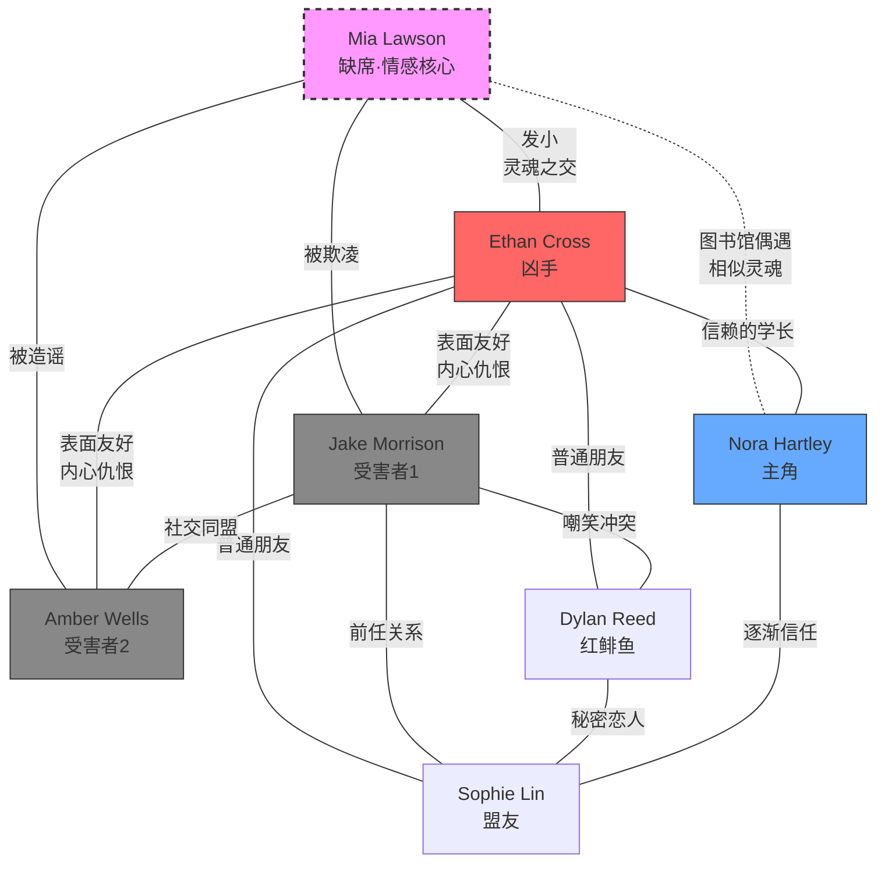

# 《密室杀人事件》— 角色系统设计

> `/characters` 阶段输出 · 极简阵容（6人）· 短篇密室推理
> 参考：character-archetype.md · Corbett 动机罗盘 · Truby 伪盟友理论
> 背景设定：美国阿巴拉契亚山区

---

## 一、侦探/主角 — Nora Hartley

### 人物档案

| 项目 | 内容 |
|------|------|
| 姓名 | Nora Hartley |
| 性别/年龄 | 女，17 岁，Junior（11年级） |
| 外表 | 瘦小，棕色长发扎低马尾，戴细框眼镜，穿深色连帽卫衣和旧帆布鞋，存在感不强 |
| 性格 | 内向敏感，观察力极强，不善社交但心思缜密。习惯在旁边看、在心里想，不轻易表态 |
| 核心缺陷 | **被动**——总是在观察，很少主动行动。遇到冲突时本能选择退缩而非介入 |
| 侦探方法论 | 不是逻辑演绎型，而是**细节直觉型**：注意到别人忽略的小事，然后反复琢磨"哪里不对"。更接近马普尔的人性观察而非福尔摩斯的冷逻辑 |
| 侦探原型 | **受困型**（普通人卷入）+ 直觉型 |
| 个人爱好 | 画画（速写本不离手），喜欢独自散步观察周围环境 |

### 个人 Stakes（双层叠加）

- **生存层**：密室杀人后，活下去成为最直接的需求
- **自我认知层**（最高 Stakes）：一直以来，Nora 把"旁观者"当作安全的身份。这次事件逼她面对一个问题——**如果不主动行动，她在乎的人就会死**。破案不只是解谜，是她从旁观者变成行动者的蜕变

### 动机罗盘（David Corbett）

```
Lack（匮乏）：在群体中永远是边缘人，从未真正"属于"任何圈子
Yearning（渴望）：被需要、被信赖——不是被接纳，而是被依靠
Resistance（抗拒）："如果我站出来说错了，会被嘲笑/排斥"
Desire（欲望）：保护身边的人活下去
```

### 角色弧光

```
起点（ch1-2）：观察者。注意到很多细节但不说，跟着群体走
转变点（ch3-4）：第一具尸体出现后，被动卷入。开始说出自己的发现，但被忽视
中间态（ch5-6）：群体分裂中被迫选择立场。第一次主动做出决定——选择信任 Sophie
终点（ch7-8）：主动追查真相，在最危险的时刻站出来对抗凶手
```

### 与案件的个人关联

Nora 其实认识 Mia Lawson——她们在学校图书馆偶尔遇到，交换过几句话。Mia 出事后，Nora 注意到了但没有做任何事。这成为她隐藏的愧疚：**"我看到了，但我什么都没做。"** 这次事件是她的赎罪和觉醒。

---

## 二、犯人/反派 — Ethan Cross

### 人物档案

| 项目 | 内容 |
|------|------|
| 姓名 | Ethan Cross |
| 性别/年龄 | 男，18 岁，Senior（12年级） |
| 外表 | 高挑结实，面容温和，笑起来让人安心。运动协调性极好（攀岩俱乐部成员） |
| 性格（表面） | 可靠、温暖、冷静、照顾人。是那种"有困难就找他"的人 |
| 性格（真实） | 极度隐忍，内心被复仇烧灼。一年来用微笑掩盖深渊般的愤怒和悲伤 |
| 社会面具 | 全校最受欢迎的学长之一，老师信任、同学喜爱。Student Council 成员，组织活动的第一人选 |

### 犯人四维设计

**一、动机（三层）**

| 层级 | 内容 |
|------|------|
| 表面动机 | （凶手暴露后群体最先想到的）"他疯了" |
| 真实动机 | 为挚友 Mia Lawson 复仇。Jake Morrison 和 Amber Wells 是伤害 Mia 的主要责任人 |
| 根源动机 | Mia 是 Ethan 从小一起长大的发小（childhood best friend）。Mia 去年因长期欺凌导致严重心理创伤而自杀未遂，目前仍在精神疗养机构。Ethan 每周去探望，Mia 已经认不出他了。**他失去了灵魂中最重要的部分，而造成这一切的人像什么都没发生过一样活着** |

**同理性等级**：Level 3-4

> "我理解他为什么这么做" → 读者在得知 Mia 的遭遇后，会对 Ethan 产生复杂的同情。他的行为是错误的，但他的痛苦是真实的。

**二、能力**

- 攀岩俱乐部成员→体能和攀爬技术足以沿石檐移动
- 上次独自来 lodge 踩点→熟悉建筑结构和弱点
- 长期伪装→心理控制力极强
- 组织者身份→掌控了人员、地点、时间

**三、伪装**

- 在事件中扮演"最冷静的人"——第一个安慰别人、第一个提出方案
- 建议"大家分开锁好门"看似保护实则隔离
- 面对调查时的策略：引导群体怀疑 Dylan Reed（因为 Dylan 和 Jake 有过冲突），同时自己扮演调解人
- 手上擦伤解释为"搬行李时刮的"

**四、弧光**

```
犯罪前（前史）：从失去 Mia 的悲伤 → 愤怒 → 冰冷的复仇决心。一年的计划期
犯罪后（ch3-5）：完成第一次杀人后内心异常平静，甚至有种"终于做了该做的事"的感觉
被调查时（ch6-7）：当主角开始接近真相，他第一次出现失控的迹象——语气中偶尔闪过的冰冷
暴露时（ch8）：不逃跑，不否认。平静地讲述 Mia 的故事。最后问所有人："Do you even remember her?"
```

### 动机罗盘

```
Lack（匮乏）：Mia——他生命中唯一真正理解他的人，如今形同死去
Yearning（渴望）：让世界记住 Mia 受到的不公。让施害者付出代价
Resistance（抗拒）：正常渠道行不通——学校掩盖、家长沉默、施害者毫无悔意
Desire（欲望）：杀死直接责任人，让他们体验 Mia 曾经的恐惧和孤立
```

### 与主角的对称性（Corbett 同源 Lack）

```
主角 Nora Hartley：
  Lack = 旁观者的疏离感（Mia 出事时她也没有行动）
  → 选择了面对愧疚、主动保护他人

犯人 Ethan Cross：
  Lack = 保护者的失败感（Mia 出事时他没能保护她）
  → 选择了以暴制暴、亲手复仇

两者的同源：都因为"没能保护重要的人"而痛苦
两者的分歧：Nora 选择信任和行动，Ethan 选择恐惧和报复
→ "我们本可以走同一条路" = 揭示时的最强共鸣
```

---

## 三、嫌疑人矩阵（极简模式 · 4 人）

> 短篇极简阵容：每个嫌疑人承担多重叙事功能（红鲱鱼 + 人物深化 + 主题映射）

| 角色 | 与主角的关系 | 表面嫌疑 | 真实角色 | 何时洗清/暴露 |
|------|------------|---------|---------|-------------|
| **Dylan Reed** | 同年级同学，不熟 | ★★★★★ 最高——与受害者1争吵过、案发夜行踪不明 | 红鲱鱼嫌疑人（实为清白） | ch6 洗清——行踪不明是去找 Sophie |
| **Sophie Lin** | 认识但不亲近 | ★★ 低——看起来最无害 | 主角的关键盟友 | — |
| **Ethan Cross** | 信赖的学长 | ★ 极低——最可靠的人 | **真凶**（伪盟友对手） | ch8 暴露 |
| **Amber Wells** | 社交圈交集 | ★★★ 中——八卦多嘴、有动机模糊性 | 受害者2（但在死前有短暂嫌疑） | ch5 成为受害者 |

### 嫌疑指数曲线

```
嫌疑度
 ↑
 │ Dylan╲              ╱Ethan
 │ ★★★★★╲            ╱ ★★★★★
 │        ╲   Amber  ╱
 │         ╲ ★★★   ╱
 │          ╲     ╱
 │           ╲  ╱
 │            ╳
 │           ╱ ╲
 │ Ethan   ╱   ╲Dylan
 │ ★      ╱     ╲ ★★
 └─────────────────────────→ 章节
   ch1  ch3  ch5  ch6  ch8
```

### 各嫌疑人详表

#### Dylan Reed（首要嫌疑人/红鲱鱼）

| 项目 | 内容 |
|------|------|
| 姓名 | Dylan Reed |
| 性别/年龄 | 男，17 岁，Junior（11年级） |
| 外表 | 偏瘦，深色长刘海半遮眼，总戴着降噪耳机，穿暗色系 |
| 性格 | 沉默寡言、敏感、有艺术气质。不擅长融入群体，有时显得阴郁 |
| 动机（假） | 与受害者 Jake Morrison 有公开冲突——旅行前被 Jake 当众嘲笑他画的画是"creepy garbage" |
| 机会 | 案发夜行踪不明（实际去了 Sophie 房间） |
| 能力 | 有（体格虽瘦但不弱） |
| 不在场证明 | 无法自证——除非承认和 Sophie 的关系 |
| 独立秘密 | 与 Sophie Lin 的秘密恋爱关系。隐瞒原因：Sophie 的前男友也在这个群体中（Jake），怕引起麻烦 |
| 消除方式 | ch6 Sophie 主动站出来证明他的行踪，恋情曝光 |
| 叙事附加值 | 消解红鲱鱼时揭示青少年间的感情纠葛，深化"秘密"主题 |

#### Sophie Lin（盟友）

| 项目 | 内容 |
|------|------|
| 姓名 | Sophie Lin |
| 性别/年龄 | 女，17 岁，Junior（11年级） |
| 外表 | 中等身高，短发，干净利落，表情认真 |
| 性格 | 理性、细心、有点焦虑。喜欢做计划、列清单，讨厌不确定性 |
| 功能角色 | 主角的能力补充（Nora 直觉强但不敢行动；Sophie 行动力强但观察力一般）|
| 关键贡献 | 提供一个关键观察——她注意到 Ethan 的鞋底有不寻常的灰白色粉末（石檐材质） |
| 秘密 | 与 Dylan Reed 的恋爱关系。同时她知道 Jake 过去对 Mia 做过的事（但当时选择了沉默） |
| 道德冲突 | 她的沉默也是 Mia 遭遇的一部分——她是否也有责任？这让她在揭示时面对自己的愧疚 |

#### Ethan Cross 嫌疑管理

| 章节 | 嫌疑控制手段 |
|------|------------|
| ch1-2 | 作为组织者出场，主动照顾每个人，建立"最不可能是凶手"的印象 |
| ch3-4 | 第一个冲到密室现场，表现出震惊和悲伤。引导大家怀疑 Dylan |
| ch5 | 提出"大家分开躲"的方案（看似保护），扮演调停者 |
| ch6 | Dylan 被洗清后，Ethan 仍然表现冷静——太冷静了（伏笔） |
| ch7 | 主角回溯时间线，发现每次"超自然事件"Ethan 都不在场。他的鞋上有石檐粉末。他对 lodge 的熟悉程度不正常 |
| ch8 | 线索收束，Ethan 被指认。他不逃、不辩——只讲 Mia 的故事 |

---

## 四、受害者

### 受害者 1 — Jake Morrison

| 项目 | 内容 |
|------|------|
| 姓名 | Jake Morrison |
| 性别/年龄 | 男，17 岁，Junior（11年级） |
| 外表 | 高大壮实，金棕色短发，阳光帅气，运动员体格。穿着时髦，总是笑着 |
| 死因 | 密室中被窒息杀害（第二晚深夜） |

**Jake Morrison 的 N 个面孔**

| 视角 | 印象 |
|------|------|
| 公众形象 | 校篮球队主力，成绩中上，老师喜欢的"golden boy" |
| 同学眼中 | 有领袖气质，大家都想跟他做朋友。有时候说话有点刻薄，但"he's just being Jake" |
| 秘密形象 | 带头欺凌 Mia 的核心人物。从起外号到社交排挤到当众羞辱。事后毫无悔意："It was just a joke" |
| 凶手眼中 | "You ruined everything she had, and then you forgot she ever existed." |

**受害者的秘密**：
他不仅欺凌了 Mia，还在 Mia 自杀未遂后，联合 Amber 向学校施压，将事件定性为"学生个人心理问题"，成功逃避了责任。

**受害者的"声音"**（死后仍在场的方式）：
- 他的手机留有与 Amber 的短信记录（讨论如何"处理"Mia 事件）
- 其他角色回忆他生前的话"Relax, it's just a ghost story"
- 他死前随身携带的一件物品成为辅助线索

### 受害者 2 — Amber Wells

| 项目 | 内容 |
|------|------|
| 姓名 | Amber Wells |
| 性别/年龄 | 女，17 岁，Junior（11年级） |
| 外表 | 金发，圆脸，爱笑，会打扮，总是叽叽喳喳说个不停 |
| 死因 | 群体分裂后与凶手独处时被杀害（第三天） |

**Amber Wells 的 N 个面孔**

| 视角 | 印象 |
|------|------|
| 公众形象 | 活泼可爱、消息灵通的"social butterfly" |
| 同学眼中 | 八卦中心。跟她做朋友很开心，但绝对不能得罪她——否则全校都会知道你的事 |
| 秘密形象 | 散布了毁灭 Mia 名誉的谣言。编造和放大了不实信息，引发了全面的社交霸凌 |
| 凶手眼中 | "You killed Mia with words. Every rumor was another knife." |

**受害者的秘密**：
Amber 当年散布谣言的原因：Mia 曾经不小心撞见她作弊，她害怕 Mia 会说出去。恐惧驱动了先发制人的攻击——**恐惧导致怀疑，怀疑导致伤害**，与主题完美呼应。

**死前短暂嫌疑期**（ch4-5）：
在 Dylan 被怀疑的同时，Amber 的反应过度紧张。她似乎知道什么不该知道的事。读者短暂怀疑她——但 ch5 末她成为第二个受害者，嫌疑自动消除。

---

## 五、缺席角色 — Mia Lawson

> Mia 不在场，但她是整个故事的情感核心。

| 项目 | 内容 |
|------|------|
| 姓名 | Mia Lawson |
| 关系 | Ethan Cross 从小一起长大的发小（childhood best friend） |
| 当前状态 | 精神疗养机构，严重心理创伤后应激障碍，已不认识任何人 |
| 性格（生前） | 安静、善良、热爱绘画。和 Nora 有微妙的相似性——都是观察者和边缘人 |

**Mia 事件时间线**：

```
一年半前：Mia 转入本校。因为性格安静、不擅社交，逐渐被边缘化
一年前春：Jake 开始带头起外号、排挤 Mia（起因是 Mia 不愿帮他作弊）
一年前夏：Amber 散布关于 Mia 的恶毒谣言（起因是 Mia 撞见 Amber 作弊）
一年前秋：Mia 在家中自杀未遂。送医抢救后存活但精神崩溃
一年前冬：学校将事件定性为"学生个人心理问题"。Jake 和 Amber 未受任何处分
半年前：Ethan 开始独自踩点 Ravenwood Lodge，计划复仇
现在：Ethan 组织"学年末旅行"，将所有相关人带到 Ravenwood Ridge
```

**Mia 在故事中的"出场"方式**：
- ch1：Ethan 手机屏保是一张合照（读者不会注意合照中的人是谁）
- ch4：Jake 手机中的短信记录提到"那件事"
- ch7：主角在 lodge 角落发现 Ethan 上次来时藏的一个物品——一本素描本，是 Mia 的画
- ch8：Ethan 讲述 Mia 的完整故事——这是全书的情感高潮

---

## 六、关系网络

### 关系图（Mermaid）



### 两两关系定义

| 关系对 | 表面关系 | 情感真相 | 信息差 | 秘密 |
|--------|---------|---------|--------|------|
| Nora↔Ethan | 学妹信赖学长 | Nora 真心信任他 / Ethan 对 Nora 无恶意但视她为"无关人" | Nora 不知 Ethan 来过 lodge | Ethan 的复仇计划 |
| Nora↔Sophie | 认识但不熟 | 危机中逐渐建立信任 | 对等 | Sophie 知道 Mia 事件但当年沉默 |
| Ethan↔Jake | 好兄弟 | Ethan 恨他入骨 | Jake 不知 Ethan 知道 Mia 的事 | Jake 欺凌 Mia |
| Ethan↔Amber | 普通朋友 | Ethan 视她为帮凶 | Amber 不知 Ethan 知道谣言是她造的 | Amber 造谣 Mia |
| Jake↔Dylan | 公开矛盾 | Jake 看不起 Dylan / Dylan 厌恶 Jake | Jake 不知 Dylan 和 Sophie 的关系 | Dylan 交往 Jake 前任 |
| Jake↔Amber | 社交同盟 | 共享秘密的利益同盟 | 都知道 Mia 事件的真相 | 联合施压学校 |
| Dylan↔Sophie | 表面无特殊关系 | 秘密恋人 | 群体不知 | 恋爱关系 |

### 秘密链

```
Ethan Cross 知道 → Jake 和 Amber 伤害 Mia 的全部真相
Jake Morrison 知道 → Amber 散布谣言的事（两人共同掩盖）
Amber Wells 知道 → Mia 撞见她作弊的事（这是她造谣的起因）
Dylan Reed 知道 → Sophie 对 Mia 事件沉默不言的愧疚
Sophie Lin 知道 → Dylan 和 Jake 冲突的真正原因
Nora Hartley 不知道任何秘密 → 她是唯一的"干净"视角
  （但她有自己的愧疚：曾看到 Mia 被欺负，没有出手）
```

---

## 七、角色与主题映射

| 角色 | 与主题"恐惧→怀疑→毁灭"的关系 |
|------|------|
| **Nora Hartley** | 主题的证明者。从恐惧退缩 → 选择信任 → 打破毁灭循环 |
| **Ethan Cross** | 主题的执行者。利用恐惧和怀疑作为武器，但他自己也是恐惧的受害者（害怕 Mia 被遗忘）|
| **Jake Morrison** | 主题的前史体现。当年因"恐惧 Mia 与众不同"而欺凌她，现在被相同的恐惧吞噬 |
| **Amber Wells** | 主题的镜像。因恐惧（怕被揭发作弊）而攻击 Mia，与凶手因恐惧（怕 Mia 被遗忘）而杀人，是同一枚硬币的两面 |
| **Dylan Reed** | 主题的反面教材。被错误地怀疑→几乎被群体"审判"→证明怀疑如何摧毁无辜 |
| **Sophie Lin** | 主题的灰色地带。当年选择沉默 = 旁观者的恐惧。现在选择信任和行动 = 赎罪 |
| **Mia Lawson** | 主题的原点。第一个被恐惧和怀疑摧毁的人。不在场，但无处不在 |

---

## 八、角色设计验证清单

### 侦探（Nora Hartley）

- [x] 有独特的推理方法论（细节直觉 + 速写记录）
- [x] 有与案件无关的个人生活（画画、散步）
- [x] 有核心缺陷（被动退缩）
- [x] 缺陷在案件中被考验（不行动就会失去朋友）
- [x] 在破案过程中经历内在变化（旁观者 → 行动者）
- [x] 有超越"解谜"的个人理由（对 Mia 的愧疚 + 保护当下的朋友）

### 犯人（Ethan Cross）

- [x] 三层动机完整（表面/真实/根源）
- [x] 同理性等级 ≥ Level 3（读者能理解他的痛苦）
- [x] 伪装逻辑自洽（社会面具、应对策略、反侦察）
- [x] 弧光有变化（暴露时的转变）
- [x] 与主角有同源 Lack（"没能保护重要的人"）
- [x] 是 Truby 伪盟友对手（表面最可靠 → 实际是对手）

### 嫌疑人矩阵

- [x] 每个嫌疑人有独立秘密
- [x] 嫌疑指数有动态变化
- [x] 红鲱鱼消解时产生叙事附加值
- [x] 真凶前期嫌疑最低、后期陡升
